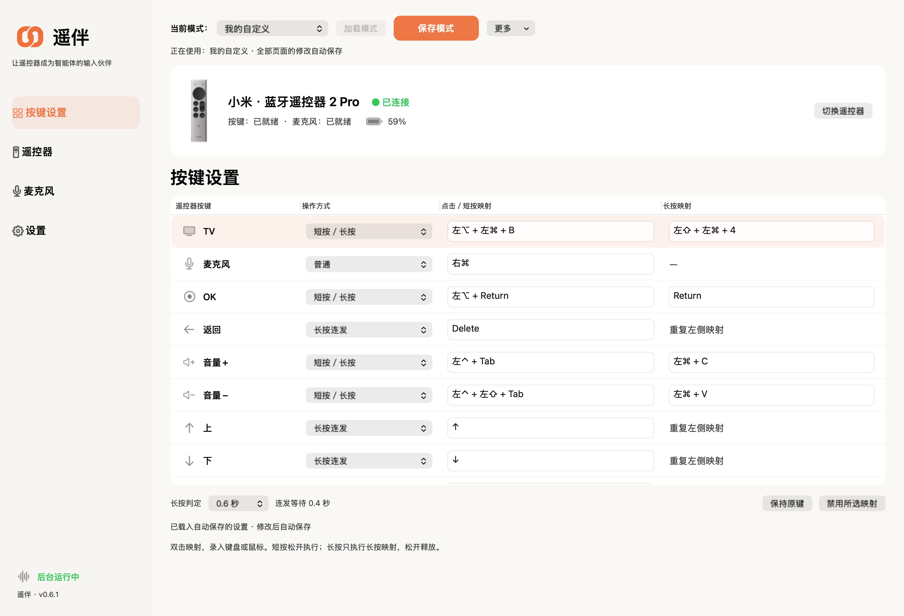

# Yovolpen 测试版正式发布

遥伴 · 0.10.8 Beta

### 少一点埋头输入，多一点创作自由。

用一只遥控器，让语音输入和 AI 协作更顺手。

**普通蓝牙遥控器　／　语音输入　／　全部按键自定义**

**[下载 0.10.8 测试版](https://github.com/cyh211-hub/yovolpen/releases/tag/v0.10.8)** · [安装指南](https://github.com/cyh211-hub/yovolpen/blob/main/docs/PUBLIC_INSTALL.md) · [交流与建议](https://github.com/cyh211-hub/yovolpen/issues)

现已开放下载与社区反馈 · Apple Silicon · macOS 26

> 下载前请知悉：当前未完成 Developer ID 签名和 Apple 公证。安装依赖 Apple Command Line Tools 提供的 Python；适配和验收范围请先看安装指南。

创作场景示意。图中界面用于说明使用方式，不代表与第三方的官方集成或兼容认证。

## 有了想法，不必每次都回到键盘前。

和桌面智能体讨论方案、修改网页，或把一段灵感写进文档。Yovolpen 把高频输入放到遥控器上：用语音表达，再用熟悉的按键切换、确认和编辑。

让遥控器成为手边的输入伙伴，把注意力留给思考。

## 从这三件事开始

| 熟悉的设备 | 自然地表达 | 按你的习惯来 |
| :--- | :--- | :--- |
| **普通蓝牙遥控器** | **语音输入** | **全部按键自定义** |
| 从已适配型号开始，无需为入门另购专用语音输入配件。 | 将遥控器声音送入虚拟麦克风，配合你选择的语音输入法。 | 将开放按键映射为键盘组合、鼠标操作，保存自己的预设。 |

Apple Siri Remote 的圆盘还可用于鼠标移动与滚动；短按、长按和连发让常用操作更顺手。

## 一个输入伙伴，多种工作场景

**桌面智能体与 AI 编程**  
说出需求、讨论思路、提出修改意见，再用自定义按键配合编辑与窗口切换。

**AI 眼镜与空间界面 · 未来探索**  
探索带可视化操作系统的眼镜如何结合语音与实体按键。**当前尚未适配。**

**文档写作**  
把灵感说下来，用快捷键完成复制、粘贴与编辑。

**PPT 制作与汇报**  
将翻页和演示快捷键放到手边，离开键盘也能掌握讲述节奏。

**阅读与日常办公**  
滚动、翻页、切换窗口，把重复操作变得顺手。

> Yovolpen 提供输入控制与音频桥接。语音识别和 AI 任务执行由你选择的软件完成；不同应用的快捷键与兼容情况需按实际环境配置。

## 看得见的设置，用得顺手的操作

0.6.1 历史界面展示，由当时界面代码与配置渲染；用于说明设置方式，并非 0.10.8 实机截图。点击图片可查看原图。

选择遥控器、设置按键、保存预设。为编程、写作、演示配置各自顺手的操作。

## 哪些设备可以开始体验？

| 设备 | 按键与映射 | 触控 | 遥控器自身麦克风 |
| :--- | :--- | :--- | :--- |
| 小米蓝牙遥控器 2 Pro（RC003） | 支持 | — | 支持，不依赖 PacketLogger |
| Apple Siri Remote 第三代 USB-C | 支持，电源键除外 | 支持 | 可选，需另装官方 PacketLogger |

本次测试范围为 **Apple Silicon / macOS 26**。其他型号、代际和系统版本不能据此推定兼容。你也可以继续使用电脑或外接麦克风。

<strong>使用 Apple 遥控器语音前，了解这项可选设置</strong>

仅使用 Apple 遥控器自身麦克风时，需要自行从 [Apple 官方下载页](https://developer.apple.com/download/all/) 获取包含 PacketLogger 的 Additional Tools for Xcode。

Yovolpen 安装包不包含 PacketLogger。未安装时仍可安装和使用按键、触控，以及小米遥控器语音。

这一语音通道使用系统蓝牙诊断入口，兼容性可能随系统变化。具体设置见 [安装指南](https://github.com/cyh211-hub/yovolpen/blob/main/docs/PUBLIC_INSTALL.md)。

## 现在就可以下载，试试你的工作方式

**Yovolpen 0.10.8 测试版已正式发布。** 安装包、源码和校验文件现已开放获取。欢迎用自己的遥控器和工作场景参与体验。

这是面向早期体验者的测试版本。不同电脑、系统和权限环境仍需进一步验证，具体安装要求与验证范围见发布页。

1. **先看要求**：[安装指南](https://github.com/cyh211-hub/yovolpen/blob/main/docs/PUBLIC_INSTALL.md)。
2. **下载体验**：[0.10.8 测试版与校验文件](https://github.com/cyh211-hub/yovolpen/releases/tag/v0.10.8)。主安装包为 `Yovolpen-0.10.8-beta.pkg`。
3. **分享反馈**：[遇到的问题，或你想实现的操作](https://github.com/cyh211-hub/yovolpen/issues)。

## 你的习惯，值得成为下一个改进

**你最希望遥控器帮你省掉哪一步操作？**

从最常用的一个按键开始，也欢迎把你的配置分享给其他人。使用中遇到问题，可以直接到社区提出。

欢迎分享使用场景、按键配置和功能建议。反馈问题时，附上软件版本、Mac 与系统版本、遥控器型号、操作步骤和实际结果即可。

**[去 GitHub 交流](https://github.com/cyh211-hub/yovolpen/issues)** · [访问 Gitee 社区](https://gitee.com/cyh830211/yovolpen)

<strong>权限、隐私与开源说明</strong>

按键控制、音频输入涉及相应系统权限，请按安装指南了解用途。语音识别与智能体处理遵循你所选择的第三方软件的数据政策。

提交问题时，请勿公开私人录音、设备地址、密码或完整诊断日志。

[隐私说明](https://github.com/cyh211-hub/yovolpen/blob/main/PRIVACY.md) · [源码构建](https://github.com/cyh211-hub/yovolpen/blob/main/docs/BUILD_FROM_SOURCE.md) · [GPL-3.0](https://github.com/cyh211-hub/yovolpen/blob/main/LICENSE) · [第三方来源](https://github.com/cyh211-hub/yovolpen/blob/main/THIRD_PARTY.md)

源代码按 GPL-3.0 提供，第三方组件及素材保留各自权利。项目与 Apple、小米、豆包或 OpenAI 无官方合作或认证关系。

---

**Yovolpen · 让你享受创作的乐趣。**

[下载测试版](https://github.com/cyh211-hub/yovolpen/releases/tag/v0.10.8) · [查看安装指南](https://github.com/cyh211-hub/yovolpen/blob/main/docs/PUBLIC_INSTALL.md) · [分享你的想法](https://github.com/cyh211-hub/yovolpen/issues)

